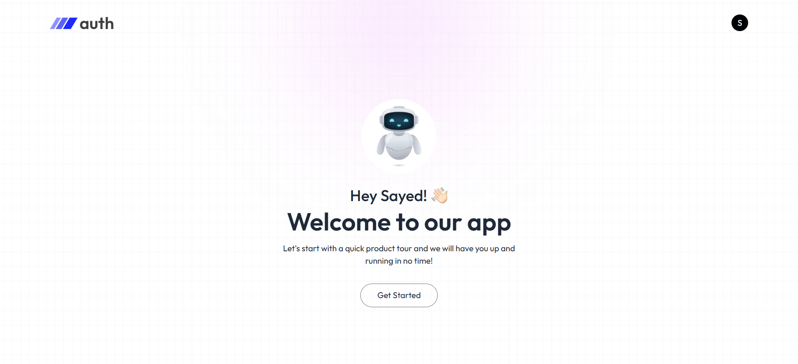
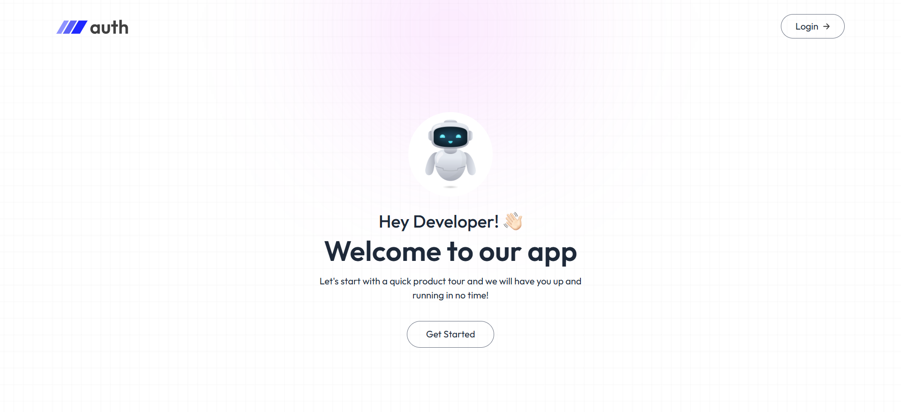
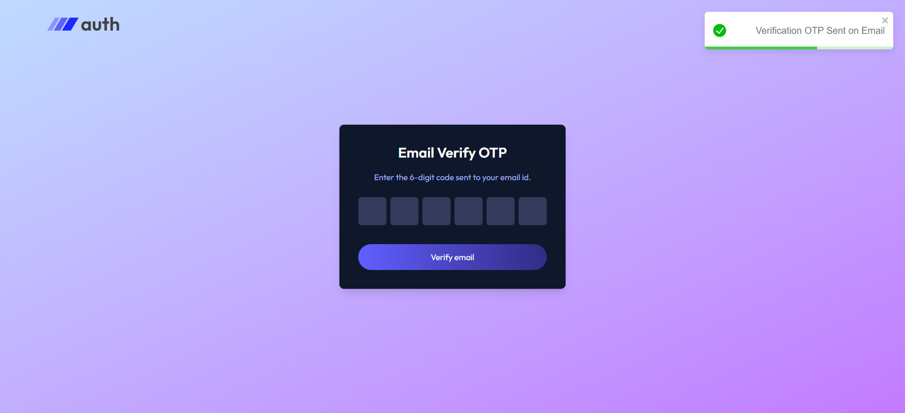

# MERN-Auth-App

<div id="top"></div>

<!-- PROJECT LOGO -->
<div align="center">
  <br>
      
    </a>
  <br>
  <br>

</div>

## About The Project

A complete authentication system built with the MERN stack, including email
verification and password reset using a secure 6-digit OTP.





### Features

-   User Registration with OTP-based email verification
-   Secure Login with JWT authentication
-   Password Reset with OTP verification
-   Fully functional authentication system with protected routes
-   Backend API built with Express and MongoDB
-   Frontend UI built with React and Tailwind CSS

### Built With

#### Backend

-   Node.js
-   Express.js
-   MongoDB
-   JSON Web Tokens (JWT)
-   Nodemailer
-   Bcrypt.js

#### Frontend

-   React
-   React Router DOM
-   Tailwind CSS
-   Axios
-   React Toastify
-   Vite

<p align="right">(<a href="#top">back to top</a>)</p>

---

## Getting Started

Follow these steps to set up the project locally.

### Installation

#### Backend Setup

1. Clone the repo

    ```sh
    git clone https://github.com/SayedShehata1/MERN-AUTH
    ```

2. Navigate to backend folder

    ```sh
    cd Server
    ```

3. Install dependencies

    ```sh
    npm install
    ```

4. Set up environmental variables in `.env` file

    ```
    MONGO_URI=your_mongodb_connection_string
    JWT_SECRET=your_jwt_secret
    EMAIL_USER=your_email
    EMAIL_PASS=your_email_password
    ```

5. Start the server

    ```sh
    npm run server
    ```

#### Frontend Setup

1. Navigate to frontend folder

    ```sh
    cd Client
    ```

2. Install dependencies

    ```sh
    npm install
    ```

3. Start the development server

    ```sh
    npm run dev
    ```

<p align="right">(<a href="#top">back to top</a>)</p>

---

### Ports and EndPoints

#### Ports

-   Backend Server runs on port `4000`
-   Frontend Development Server runs on port `5173`

#### API endpoints

**Main URL**: [http://localhost:4000](http://localhost:4000)

-   Register User: `POST /api/auth/register`
-   Login User: `POST /api/auth/login`
-   Logout User: `POST /api/auth/logout`
-   Send OTP to Verify Email: `POST /api/auth/send-verify-otp`
-   Verify Email: `POST /api/auth/verify-account`
-   Send OTP to Reset Password: `POST /api/auth/send-reset-otp`
-   Reset Password: `POST /api/auth/reset-password`
-   Get User Data: `GET /user/data`

<p align="right">(<a href="#top">back to top</a>)</p>

---

## Contributing

Contributions are what make the open-source community such an amazing place to
learn, inspire, and create. Any contributions you make are **greatly
appreciated**.

If you have a suggestion that would make this better, please fork the repo and
create a pull request. You can also simply open an issue with the tag
"enhancement". Don't forget to give the project a star! Thanks again!

1. Fork the Project
2. Create your Feature Branch (`git checkout -b feature/AmazingFeature`)
3. Commit your Changes (`git commit -m 'Add some AmazingFeature'`)
4. Push to the Branch (`git push origin feature/AmazingFeature`)
5. Open a Pull Request

<p align="right">(<a href="#top">back to top</a>)</p>
